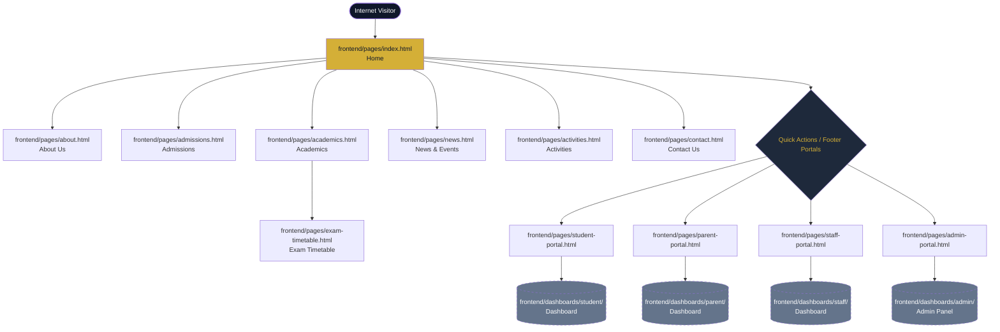
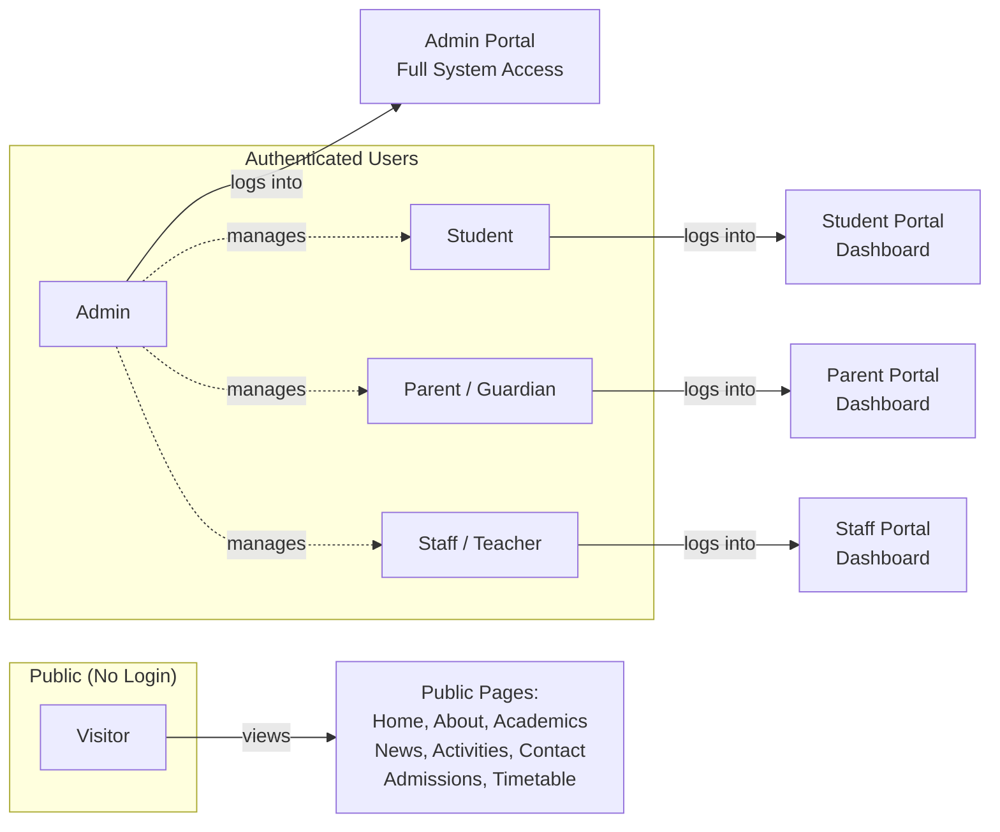
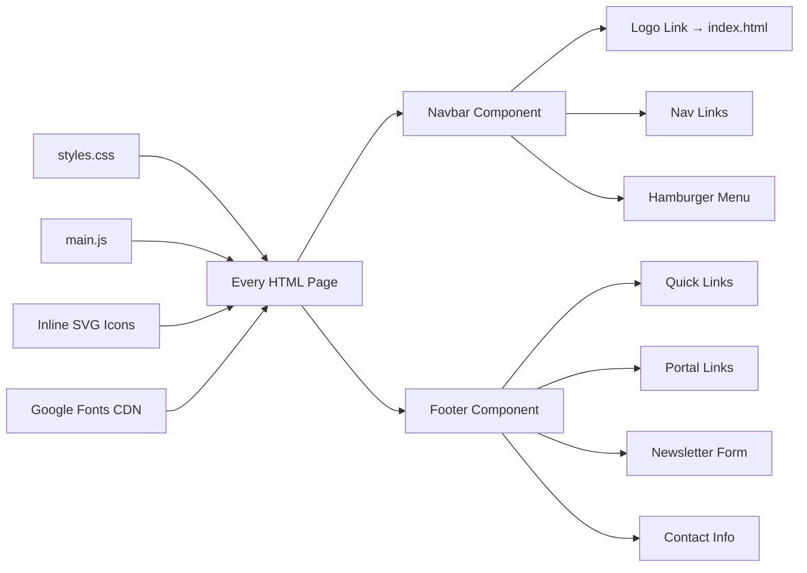
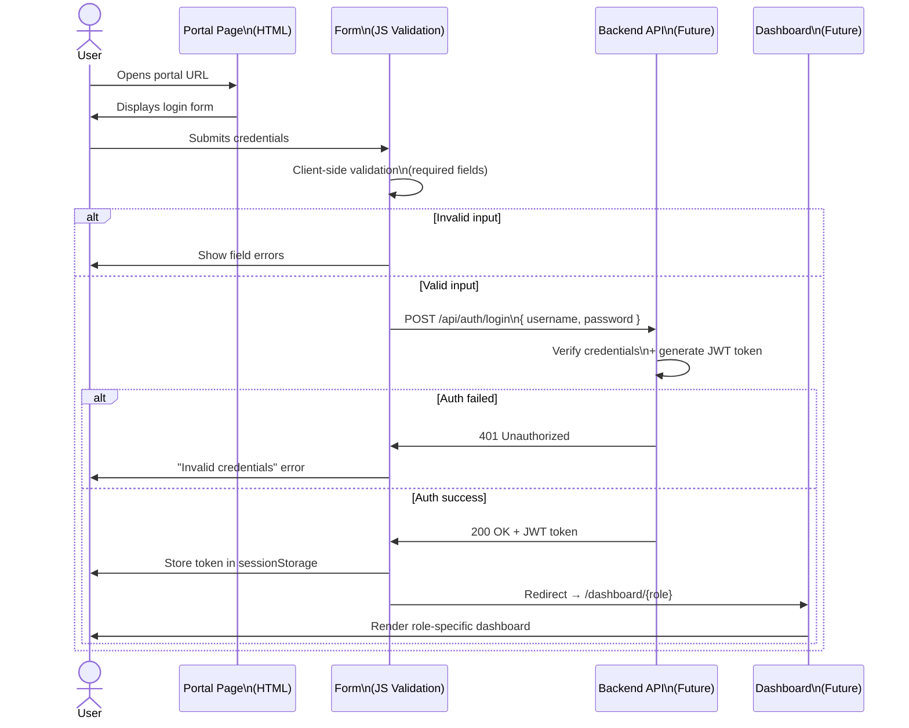
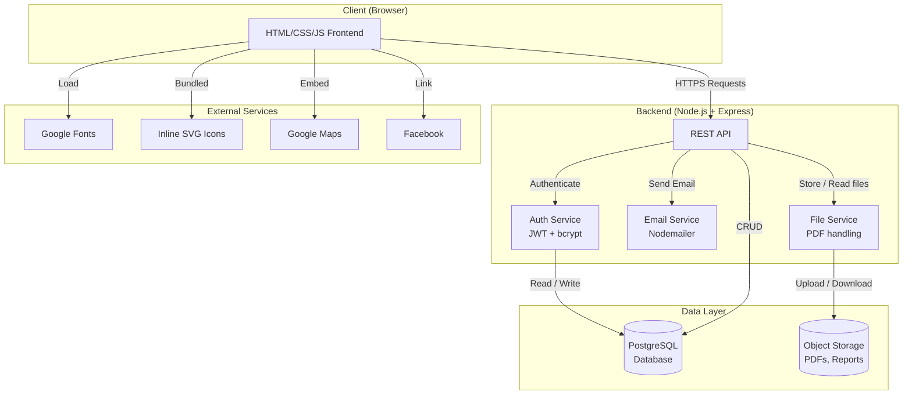
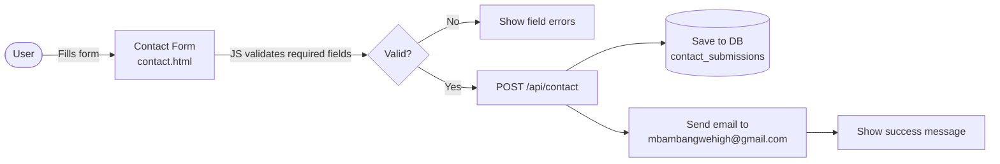
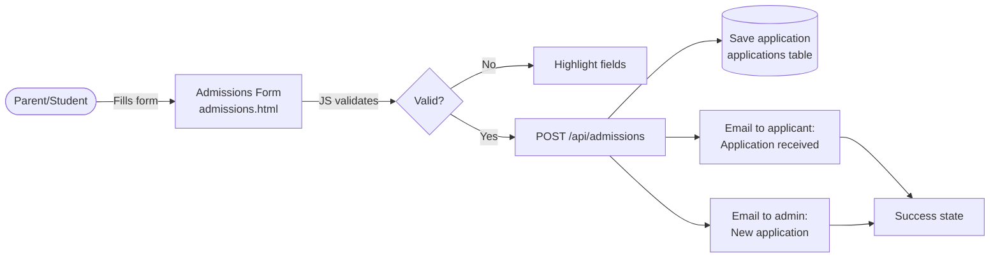
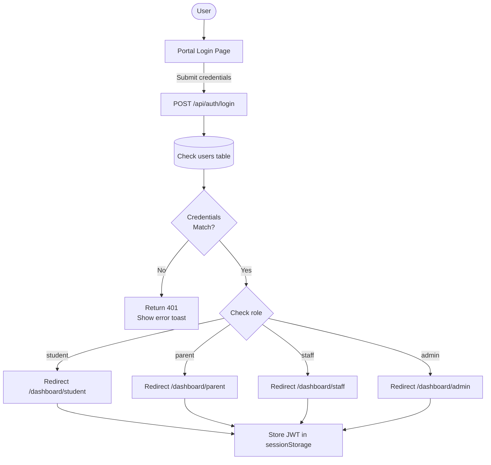
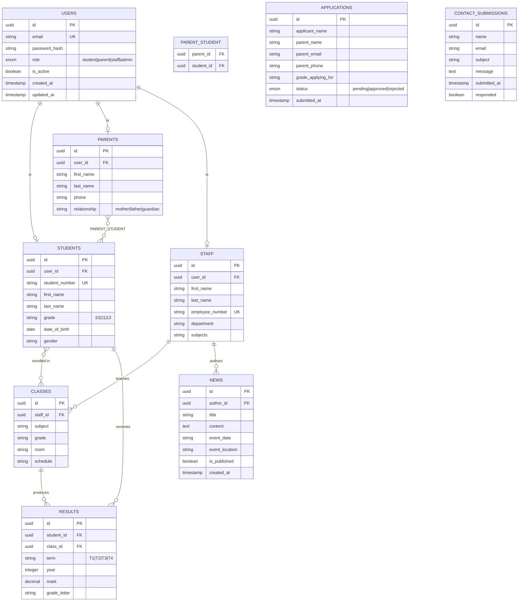
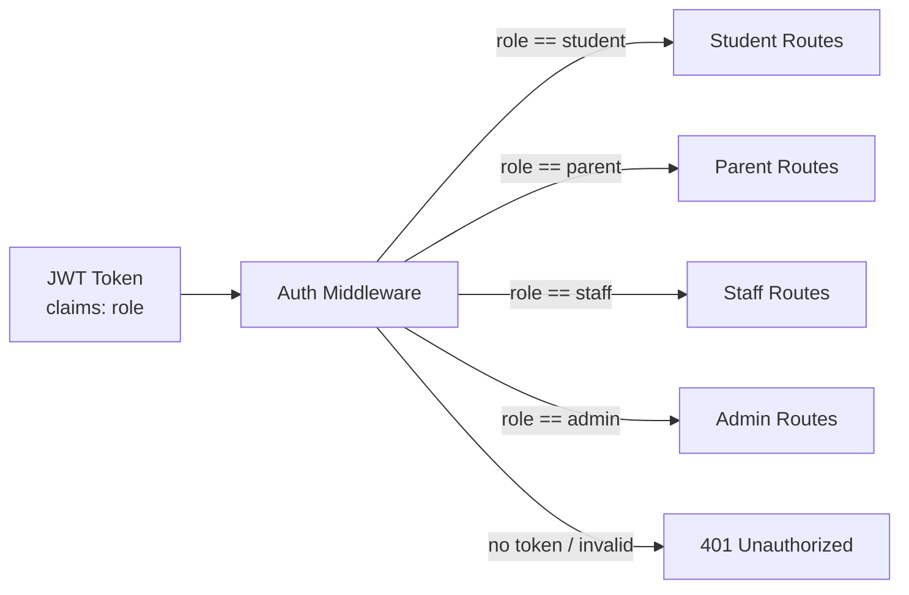

# Mbambangwe High School — Frontend & Backend Design Layout

> **Project:** Mbambangwe High School Website  
> **Stack:** HTML · Vanilla CSS · Vanilla JavaScript  
> **Version:** 2.0 | **Last Updated:** July 2026

---

## Table of Contents

1. [Project Structure](#1-project-structure)
2. [Page Map & Navigation Flow](#2-page-map--navigation-flow)
3. [User Roles](#3-user-roles)
4. [Frontend Architecture](#4-frontend-architecture)
5. [Page-by-Page Breakdown](#5-page-by-page-breakdown)
6. [Portal Access Flow](#6-portal-access-flow)
7. [Shared Components](#7-shared-components)
8. [CSS Design System](#8-css-design-system)
9. [Backend Architecture (Planned)](#9-backend-architecture-planned)
10. [Data Flow Diagram](#10-data-flow-diagram)
11. [API Endpoints (Planned)](#11-api-endpoints-planned)
12. [Database Schema (Planned)](#12-database-schema-planned)
13. [Security Model](#13-security-model)
14. [Deployment Plan](#14-deployment-plan)

---

## 1. Project Structure

```
Mbambangwe/
│
├── README.md
├── LICENSE
├── .gitignore
├── docker-compose.yml
├── design_layout.md
├── docs/
│   ├── architecture.md
│   ├── api.md
│   ├── database.md
│   ├── deployment.md
│   ├── security.md
│   ├── testing.md
│   └── user-manual.md
│
├── frontend/
│   ├── package.json
│   ├── public/
│   │   ├── favicon.ico
│   │   ├── robots.txt
│   │   └── manifest.json
│   │
│   ├── assets/
│   │   ├── css/
│   │   │   ├── variables.css
│   │   │   ├── typography.css
│   │   │   ├── layout.css
│   │   │   ├── components.css
│   │   │   ├── animations.css
│   │   │   └── responsive.css
│   │   │
│   │   ├── js/
│   │   │   ├── api.js
│   │   │   ├── auth.js
│   │   │   ├── helpers.js
│   │   │   └── main.js
│   │   │
│   │   ├── images/
│   │   ├── icons/
│   │   ├── fonts/
│   │   └── videos/
│   │
│   ├── components/
│   │   ├── navbar.html
│   │   ├── footer.html
│   │   ├── sidebar.html
│   │   ├── modal.html
│   │   └── loader.html
│   │
│   ├── pages/
│   │   ├── index.html
│   │   ├── about.html
│   │   ├── admissions.html
│   │   ├── academics.html
│   │   ├── activities.html
│   │   ├── gallery.html
│   │   ├── news.html
│   │   ├── contact.html
│   │   ├── faq.html
│   │   ├── privacy.html
│   │   ├── terms.html
│   │   └── login.html
│   │
│   └── dashboards/
│       ├── student/
│       ├── parent/
│       ├── staff/
│       └── admin/
│
├── backend/
│   ├── package.json
│   ├── .env
│   ├── .env.example
│   ├── Dockerfile
│   │
│   ├── prisma/
│   │   ├── migrations/
│   │   ├── schema.prisma
│   │   └── seed.js
│   │
│   ├── uploads/
│   │   ├── profile-images/
│   │   ├── assignments/
│   │   ├── reports/
│   │   └── certificates/
│   │
│   ├── logs/
│   │
│   ├── src/
│   │   ├── config/
│   │   ├── controllers/
│   │   ├── services/
│   │   ├── repositories/
│   │   ├── middleware/
│   │   ├── routes/
│   │   ├── validators/
│   │   ├── sockets/
│   │   ├── cron/
│   │   ├── emails/
│   │   ├── notifications/
│   │   ├── cache/
│   │   ├── storage/
│   │   ├── utils/
│   │   ├── constants/
│   │   ├── types/
│   │   ├── app.js
│   │   └── server.js
│   │
│   └── tests/
│       ├── integration/
│       ├── unit/
│       └── e2e/
│
├── database/
│   ├── backups/
│   ├── scripts/
│   └── diagrams/
│
├── scripts/
│   ├── install.sh
│   ├── backup.sh
│   ├── restore.sh
│   └── deploy.sh
│
├── monitoring/
│   ├── health-check.js
│   ├── metrics.js
│   └── uptime.js
│
└── .github/
    └── workflows/
        ├── test.yml
        ├── lint.yml
        └── deploy.yml
```

---

## 2. Page Map & Navigation Flow

### Site-Wide Navigation Tree



### Page Link Matrix

| From → To | Home | About | Admissions | Academics | News | Activities | Contact | Portals | Timetable |
|-----------|:----:|:-----:|:----------:|:---------:|:----:|:----------:|:-------:|:-------:|:---------:|
| **Home (index)** | — | <svg width="14" height="14" viewBox="0 0 24 24" fill="none" stroke="#16a34a" stroke-width="3" xmlns="http://www.w3.org/2000/svg"><polyline points="20 6 9 17 4 12"/></svg> | <svg width="14" height="14" viewBox="0 0 24 24" fill="none" stroke="#16a34a" stroke-width="3" xmlns="http://www.w3.org/2000/svg"><polyline points="20 6 9 17 4 12"/></svg> | <svg width="14" height="14" viewBox="0 0 24 24" fill="none" stroke="#16a34a" stroke-width="3" xmlns="http://www.w3.org/2000/svg"><polyline points="20 6 9 17 4 12"/></svg> | <svg width="14" height="14" viewBox="0 0 24 24" fill="none" stroke="#16a34a" stroke-width="3" xmlns="http://www.w3.org/2000/svg"><polyline points="20 6 9 17 4 12"/></svg> | <svg width="14" height="14" viewBox="0 0 24 24" fill="none" stroke="#16a34a" stroke-width="3" xmlns="http://www.w3.org/2000/svg"><polyline points="20 6 9 17 4 12"/></svg> | <svg width="14" height="14" viewBox="0 0 24 24" fill="none" stroke="#16a34a" stroke-width="3" xmlns="http://www.w3.org/2000/svg"><polyline points="20 6 9 17 4 12"/></svg> | <svg width="14" height="14" viewBox="0 0 24 24" fill="none" stroke="#16a34a" stroke-width="3" xmlns="http://www.w3.org/2000/svg"><polyline points="20 6 9 17 4 12"/></svg> | <svg width="14" height="14" viewBox="0 0 24 24" fill="none" stroke="#dc2626" stroke-width="3" xmlns="http://www.w3.org/2000/svg"><line x1="18" y1="6" x2="6" y2="18"/><line x1="6" y1="6" x2="18" y2="18"/></svg> |
| **About** | <svg width="14" height="14" viewBox="0 0 24 24" fill="none" stroke="#16a34a" stroke-width="3" xmlns="http://www.w3.org/2000/svg"><polyline points="20 6 9 17 4 12"/></svg> | — | <svg width="14" height="14" viewBox="0 0 24 24" fill="none" stroke="#16a34a" stroke-width="3" xmlns="http://www.w3.org/2000/svg"><polyline points="20 6 9 17 4 12"/></svg> | <svg width="14" height="14" viewBox="0 0 24 24" fill="none" stroke="#16a34a" stroke-width="3" xmlns="http://www.w3.org/2000/svg"><polyline points="20 6 9 17 4 12"/></svg> | <svg width="14" height="14" viewBox="0 0 24 24" fill="none" stroke="#16a34a" stroke-width="3" xmlns="http://www.w3.org/2000/svg"><polyline points="20 6 9 17 4 12"/></svg> | <svg width="14" height="14" viewBox="0 0 24 24" fill="none" stroke="#16a34a" stroke-width="3" xmlns="http://www.w3.org/2000/svg"><polyline points="20 6 9 17 4 12"/></svg> | <svg width="14" height="14" viewBox="0 0 24 24" fill="none" stroke="#16a34a" stroke-width="3" xmlns="http://www.w3.org/2000/svg"><polyline points="20 6 9 17 4 12"/></svg> | <svg width="14" height="14" viewBox="0 0 24 24" fill="none" stroke="#16a34a" stroke-width="3" xmlns="http://www.w3.org/2000/svg"><polyline points="20 6 9 17 4 12"/></svg> | <svg width="14" height="14" viewBox="0 0 24 24" fill="none" stroke="#dc2626" stroke-width="3" xmlns="http://www.w3.org/2000/svg"><line x1="18" y1="6" x2="6" y2="18"/><line x1="6" y1="6" x2="18" y2="18"/></svg> |
| **Admissions** | <svg width="14" height="14" viewBox="0 0 24 24" fill="none" stroke="#16a34a" stroke-width="3" xmlns="http://www.w3.org/2000/svg"><polyline points="20 6 9 17 4 12"/></svg> | <svg width="14" height="14" viewBox="0 0 24 24" fill="none" stroke="#16a34a" stroke-width="3" xmlns="http://www.w3.org/2000/svg"><polyline points="20 6 9 17 4 12"/></svg> | — | <svg width="14" height="14" viewBox="0 0 24 24" fill="none" stroke="#16a34a" stroke-width="3" xmlns="http://www.w3.org/2000/svg"><polyline points="20 6 9 17 4 12"/></svg> | <svg width="14" height="14" viewBox="0 0 24 24" fill="none" stroke="#16a34a" stroke-width="3" xmlns="http://www.w3.org/2000/svg"><polyline points="20 6 9 17 4 12"/></svg> | <svg width="14" height="14" viewBox="0 0 24 24" fill="none" stroke="#16a34a" stroke-width="3" xmlns="http://www.w3.org/2000/svg"><polyline points="20 6 9 17 4 12"/></svg> | <svg width="14" height="14" viewBox="0 0 24 24" fill="none" stroke="#16a34a" stroke-width="3" xmlns="http://www.w3.org/2000/svg"><polyline points="20 6 9 17 4 12"/></svg> | <svg width="14" height="14" viewBox="0 0 24 24" fill="none" stroke="#16a34a" stroke-width="3" xmlns="http://www.w3.org/2000/svg"><polyline points="20 6 9 17 4 12"/></svg> | <svg width="14" height="14" viewBox="0 0 24 24" fill="none" stroke="#dc2626" stroke-width="3" xmlns="http://www.w3.org/2000/svg"><line x1="18" y1="6" x2="6" y2="18"/><line x1="6" y1="6" x2="18" y2="18"/></svg> |
| **Academics** | <svg width="14" height="14" viewBox="0 0 24 24" fill="none" stroke="#16a34a" stroke-width="3" xmlns="http://www.w3.org/2000/svg"><polyline points="20 6 9 17 4 12"/></svg> | <svg width="14" height="14" viewBox="0 0 24 24" fill="none" stroke="#16a34a" stroke-width="3" xmlns="http://www.w3.org/2000/svg"><polyline points="20 6 9 17 4 12"/></svg> | <svg width="14" height="14" viewBox="0 0 24 24" fill="none" stroke="#16a34a" stroke-width="3" xmlns="http://www.w3.org/2000/svg"><polyline points="20 6 9 17 4 12"/></svg> | — | <svg width="14" height="14" viewBox="0 0 24 24" fill="none" stroke="#16a34a" stroke-width="3" xmlns="http://www.w3.org/2000/svg"><polyline points="20 6 9 17 4 12"/></svg> | <svg width="14" height="14" viewBox="0 0 24 24" fill="none" stroke="#16a34a" stroke-width="3" xmlns="http://www.w3.org/2000/svg"><polyline points="20 6 9 17 4 12"/></svg> | <svg width="14" height="14" viewBox="0 0 24 24" fill="none" stroke="#16a34a" stroke-width="3" xmlns="http://www.w3.org/2000/svg"><polyline points="20 6 9 17 4 12"/></svg> | <svg width="14" height="14" viewBox="0 0 24 24" fill="none" stroke="#16a34a" stroke-width="3" xmlns="http://www.w3.org/2000/svg"><polyline points="20 6 9 17 4 12"/></svg> | <svg width="14" height="14" viewBox="0 0 24 24" fill="none" stroke="#16a34a" stroke-width="3" xmlns="http://www.w3.org/2000/svg"><polyline points="20 6 9 17 4 12"/></svg> |
| **News** | <svg width="14" height="14" viewBox="0 0 24 24" fill="none" stroke="#16a34a" stroke-width="3" xmlns="http://www.w3.org/2000/svg"><polyline points="20 6 9 17 4 12"/></svg> | <svg width="14" height="14" viewBox="0 0 24 24" fill="none" stroke="#16a34a" stroke-width="3" xmlns="http://www.w3.org/2000/svg"><polyline points="20 6 9 17 4 12"/></svg> | <svg width="14" height="14" viewBox="0 0 24 24" fill="none" stroke="#16a34a" stroke-width="3" xmlns="http://www.w3.org/2000/svg"><polyline points="20 6 9 17 4 12"/></svg> | <svg width="14" height="14" viewBox="0 0 24 24" fill="none" stroke="#16a34a" stroke-width="3" xmlns="http://www.w3.org/2000/svg"><polyline points="20 6 9 17 4 12"/></svg> | — | <svg width="14" height="14" viewBox="0 0 24 24" fill="none" stroke="#16a34a" stroke-width="3" xmlns="http://www.w3.org/2000/svg"><polyline points="20 6 9 17 4 12"/></svg> | <svg width="14" height="14" viewBox="0 0 24 24" fill="none" stroke="#16a34a" stroke-width="3" xmlns="http://www.w3.org/2000/svg"><polyline points="20 6 9 17 4 12"/></svg> | <svg width="14" height="14" viewBox="0 0 24 24" fill="none" stroke="#16a34a" stroke-width="3" xmlns="http://www.w3.org/2000/svg"><polyline points="20 6 9 17 4 12"/></svg> | <svg width="14" height="14" viewBox="0 0 24 24" fill="none" stroke="#dc2626" stroke-width="3" xmlns="http://www.w3.org/2000/svg"><line x1="18" y1="6" x2="6" y2="18"/><line x1="6" y1="6" x2="18" y2="18"/></svg> |
| **Activities** | <svg width="14" height="14" viewBox="0 0 24 24" fill="none" stroke="#16a34a" stroke-width="3" xmlns="http://www.w3.org/2000/svg"><polyline points="20 6 9 17 4 12"/></svg> | <svg width="14" height="14" viewBox="0 0 24 24" fill="none" stroke="#16a34a" stroke-width="3" xmlns="http://www.w3.org/2000/svg"><polyline points="20 6 9 17 4 12"/></svg> | <svg width="14" height="14" viewBox="0 0 24 24" fill="none" stroke="#16a34a" stroke-width="3" xmlns="http://www.w3.org/2000/svg"><polyline points="20 6 9 17 4 12"/></svg> | <svg width="14" height="14" viewBox="0 0 24 24" fill="none" stroke="#16a34a" stroke-width="3" xmlns="http://www.w3.org/2000/svg"><polyline points="20 6 9 17 4 12"/></svg> | <svg width="14" height="14" viewBox="0 0 24 24" fill="none" stroke="#16a34a" stroke-width="3" xmlns="http://www.w3.org/2000/svg"><polyline points="20 6 9 17 4 12"/></svg> | — | <svg width="14" height="14" viewBox="0 0 24 24" fill="none" stroke="#16a34a" stroke-width="3" xmlns="http://www.w3.org/2000/svg"><polyline points="20 6 9 17 4 12"/></svg> | <svg width="14" height="14" viewBox="0 0 24 24" fill="none" stroke="#16a34a" stroke-width="3" xmlns="http://www.w3.org/2000/svg"><polyline points="20 6 9 17 4 12"/></svg> | <svg width="14" height="14" viewBox="0 0 24 24" fill="none" stroke="#dc2626" stroke-width="3" xmlns="http://www.w3.org/2000/svg"><line x1="18" y1="6" x2="6" y2="18"/><line x1="6" y1="6" x2="18" y2="18"/></svg> |
| **Contact** | <svg width="14" height="14" viewBox="0 0 24 24" fill="none" stroke="#16a34a" stroke-width="3" xmlns="http://www.w3.org/2000/svg"><polyline points="20 6 9 17 4 12"/></svg> | <svg width="14" height="14" viewBox="0 0 24 24" fill="none" stroke="#16a34a" stroke-width="3" xmlns="http://www.w3.org/2000/svg"><polyline points="20 6 9 17 4 12"/></svg> | <svg width="14" height="14" viewBox="0 0 24 24" fill="none" stroke="#16a34a" stroke-width="3" xmlns="http://www.w3.org/2000/svg"><polyline points="20 6 9 17 4 12"/></svg> | <svg width="14" height="14" viewBox="0 0 24 24" fill="none" stroke="#16a34a" stroke-width="3" xmlns="http://www.w3.org/2000/svg"><polyline points="20 6 9 17 4 12"/></svg> | <svg width="14" height="14" viewBox="0 0 24 24" fill="none" stroke="#16a34a" stroke-width="3" xmlns="http://www.w3.org/2000/svg"><polyline points="20 6 9 17 4 12"/></svg> | <svg width="14" height="14" viewBox="0 0 24 24" fill="none" stroke="#16a34a" stroke-width="3" xmlns="http://www.w3.org/2000/svg"><polyline points="20 6 9 17 4 12"/></svg> | — | <svg width="14" height="14" viewBox="0 0 24 24" fill="none" stroke="#16a34a" stroke-width="3" xmlns="http://www.w3.org/2000/svg"><polyline points="20 6 9 17 4 12"/></svg> | <svg width="14" height="14" viewBox="0 0 24 24" fill="none" stroke="#dc2626" stroke-width="3" xmlns="http://www.w3.org/2000/svg"><line x1="18" y1="6" x2="6" y2="18"/><line x1="6" y1="6" x2="18" y2="18"/></svg> |
| **Exam Timetable** | <svg width="14" height="14" viewBox="0 0 24 24" fill="none" stroke="#16a34a" stroke-width="3" xmlns="http://www.w3.org/2000/svg"><polyline points="20 6 9 17 4 12"/></svg> (back) | <svg width="14" height="14" viewBox="0 0 24 24" fill="none" stroke="#dc2626" stroke-width="3" xmlns="http://www.w3.org/2000/svg"><line x1="18" y1="6" x2="6" y2="18"/><line x1="6" y1="6" x2="18" y2="18"/></svg> | <svg width="14" height="14" viewBox="0 0 24 24" fill="none" stroke="#dc2626" stroke-width="3" xmlns="http://www.w3.org/2000/svg"><line x1="18" y1="6" x2="6" y2="18"/><line x1="6" y1="6" x2="18" y2="18"/></svg> | <svg width="14" height="14" viewBox="0 0 24 24" fill="none" stroke="#16a34a" stroke-width="3" xmlns="http://www.w3.org/2000/svg"><polyline points="20 6 9 17 4 12"/></svg> (back) | <svg width="14" height="14" viewBox="0 0 24 24" fill="none" stroke="#dc2626" stroke-width="3" xmlns="http://www.w3.org/2000/svg"><line x1="18" y1="6" x2="6" y2="18"/><line x1="6" y1="6" x2="18" y2="18"/></svg> | <svg width="14" height="14" viewBox="0 0 24 24" fill="none" stroke="#dc2626" stroke-width="3" xmlns="http://www.w3.org/2000/svg"><line x1="18" y1="6" x2="6" y2="18"/><line x1="6" y1="6" x2="18" y2="18"/></svg> | <svg width="14" height="14" viewBox="0 0 24 24" fill="none" stroke="#dc2626" stroke-width="3" xmlns="http://www.w3.org/2000/svg"><line x1="18" y1="6" x2="6" y2="18"/><line x1="6" y1="6" x2="18" y2="18"/></svg> | <svg width="14" height="14" viewBox="0 0 24 24" fill="none" stroke="#16a34a" stroke-width="3" xmlns="http://www.w3.org/2000/svg"><polyline points="20 6 9 17 4 12"/></svg> | — |
| **Student Portal** | <svg width="14" height="14" viewBox="0 0 24 24" fill="none" stroke="#16a34a" stroke-width="3" xmlns="http://www.w3.org/2000/svg"><polyline points="20 6 9 17 4 12"/></svg> (back) | <svg width="14" height="14" viewBox="0 0 24 24" fill="none" stroke="#dc2626" stroke-width="3" xmlns="http://www.w3.org/2000/svg"><line x1="18" y1="6" x2="6" y2="18"/><line x1="6" y1="6" x2="18" y2="18"/></svg> | <svg width="14" height="14" viewBox="0 0 24 24" fill="none" stroke="#dc2626" stroke-width="3" xmlns="http://www.w3.org/2000/svg"><line x1="18" y1="6" x2="6" y2="18"/><line x1="6" y1="6" x2="18" y2="18"/></svg> | <svg width="14" height="14" viewBox="0 0 24 24" fill="none" stroke="#dc2626" stroke-width="3" xmlns="http://www.w3.org/2000/svg"><line x1="18" y1="6" x2="6" y2="18"/><line x1="6" y1="6" x2="18" y2="18"/></svg> | <svg width="14" height="14" viewBox="0 0 24 24" fill="none" stroke="#dc2626" stroke-width="3" xmlns="http://www.w3.org/2000/svg"><line x1="18" y1="6" x2="6" y2="18"/><line x1="6" y1="6" x2="18" y2="18"/></svg> | <svg width="14" height="14" viewBox="0 0 24 24" fill="none" stroke="#dc2626" stroke-width="3" xmlns="http://www.w3.org/2000/svg"><line x1="18" y1="6" x2="6" y2="18"/><line x1="6" y1="6" x2="18" y2="18"/></svg> | <svg width="14" height="14" viewBox="0 0 24 24" fill="none" stroke="#16a34a" stroke-width="3" xmlns="http://www.w3.org/2000/svg"><polyline points="20 6 9 17 4 12"/></svg> (forgot pw) | <svg width="14" height="14" viewBox="0 0 24 24" fill="none" stroke="#dc2626" stroke-width="3" xmlns="http://www.w3.org/2000/svg"><line x1="18" y1="6" x2="6" y2="18"/><line x1="6" y1="6" x2="18" y2="18"/></svg> | <svg width="14" height="14" viewBox="0 0 24 24" fill="none" stroke="#dc2626" stroke-width="3" xmlns="http://www.w3.org/2000/svg"><line x1="18" y1="6" x2="6" y2="18"/><line x1="6" y1="6" x2="18" y2="18"/></svg> |
| **Parent Portal** | <svg width="14" height="14" viewBox="0 0 24 24" fill="none" stroke="#16a34a" stroke-width="3" xmlns="http://www.w3.org/2000/svg"><polyline points="20 6 9 17 4 12"/></svg> (back) | <svg width="14" height="14" viewBox="0 0 24 24" fill="none" stroke="#dc2626" stroke-width="3" xmlns="http://www.w3.org/2000/svg"><line x1="18" y1="6" x2="6" y2="18"/><line x1="6" y1="6" x2="18" y2="18"/></svg> | <svg width="14" height="14" viewBox="0 0 24 24" fill="none" stroke="#dc2626" stroke-width="3" xmlns="http://www.w3.org/2000/svg"><line x1="18" y1="6" x2="6" y2="18"/><line x1="6" y1="6" x2="18" y2="18"/></svg> | <svg width="14" height="14" viewBox="0 0 24 24" fill="none" stroke="#dc2626" stroke-width="3" xmlns="http://www.w3.org/2000/svg"><line x1="18" y1="6" x2="6" y2="18"/><line x1="6" y1="6" x2="18" y2="18"/></svg> | <svg width="14" height="14" viewBox="0 0 24 24" fill="none" stroke="#dc2626" stroke-width="3" xmlns="http://www.w3.org/2000/svg"><line x1="18" y1="6" x2="6" y2="18"/><line x1="6" y1="6" x2="18" y2="18"/></svg> | <svg width="14" height="14" viewBox="0 0 24 24" fill="none" stroke="#dc2626" stroke-width="3" xmlns="http://www.w3.org/2000/svg"><line x1="18" y1="6" x2="6" y2="18"/><line x1="6" y1="6" x2="18" y2="18"/></svg> | <svg width="14" height="14" viewBox="0 0 24 24" fill="none" stroke="#16a34a" stroke-width="3" xmlns="http://www.w3.org/2000/svg"><polyline points="20 6 9 17 4 12"/></svg> (forgot pw) | <svg width="14" height="14" viewBox="0 0 24 24" fill="none" stroke="#dc2626" stroke-width="3" xmlns="http://www.w3.org/2000/svg"><line x1="18" y1="6" x2="6" y2="18"/><line x1="6" y1="6" x2="18" y2="18"/></svg> | <svg width="14" height="14" viewBox="0 0 24 24" fill="none" stroke="#dc2626" stroke-width="3" xmlns="http://www.w3.org/2000/svg"><line x1="18" y1="6" x2="6" y2="18"/><line x1="6" y1="6" x2="18" y2="18"/></svg> |
| **Staff Portal** | <svg width="14" height="14" viewBox="0 0 24 24" fill="none" stroke="#16a34a" stroke-width="3" xmlns="http://www.w3.org/2000/svg"><polyline points="20 6 9 17 4 12"/></svg> (back) | <svg width="14" height="14" viewBox="0 0 24 24" fill="none" stroke="#dc2626" stroke-width="3" xmlns="http://www.w3.org/2000/svg"><line x1="18" y1="6" x2="6" y2="18"/><line x1="6" y1="6" x2="18" y2="18"/></svg> | <svg width="14" height="14" viewBox="0 0 24 24" fill="none" stroke="#dc2626" stroke-width="3" xmlns="http://www.w3.org/2000/svg"><line x1="18" y1="6" x2="6" y2="18"/><line x1="6" y1="6" x2="18" y2="18"/></svg> | <svg width="14" height="14" viewBox="0 0 24 24" fill="none" stroke="#dc2626" stroke-width="3" xmlns="http://www.w3.org/2000/svg"><line x1="18" y1="6" x2="6" y2="18"/><line x1="6" y1="6" x2="18" y2="18"/></svg> | <svg width="14" height="14" viewBox="0 0 24 24" fill="none" stroke="#dc2626" stroke-width="3" xmlns="http://www.w3.org/2000/svg"><line x1="18" y1="6" x2="6" y2="18"/><line x1="6" y1="6" x2="18" y2="18"/></svg> | <svg width="14" height="14" viewBox="0 0 24 24" fill="none" stroke="#dc2626" stroke-width="3" xmlns="http://www.w3.org/2000/svg"><line x1="18" y1="6" x2="6" y2="18"/><line x1="6" y1="6" x2="18" y2="18"/></svg> | <svg width="14" height="14" viewBox="0 0 24 24" fill="none" stroke="#16a34a" stroke-width="3" xmlns="http://www.w3.org/2000/svg"><polyline points="20 6 9 17 4 12"/></svg> (reset pw) | <svg width="14" height="14" viewBox="0 0 24 24" fill="none" stroke="#dc2626" stroke-width="3" xmlns="http://www.w3.org/2000/svg"><line x1="18" y1="6" x2="6" y2="18"/><line x1="6" y1="6" x2="18" y2="18"/></svg> | <svg width="14" height="14" viewBox="0 0 24 24" fill="none" stroke="#dc2626" stroke-width="3" xmlns="http://www.w3.org/2000/svg"><line x1="18" y1="6" x2="6" y2="18"/><line x1="6" y1="6" x2="18" y2="18"/></svg> |
| **Admin Portal** | <svg width="14" height="14" viewBox="0 0 24 24" fill="none" stroke="#16a34a" stroke-width="3" xmlns="http://www.w3.org/2000/svg"><polyline points="20 6 9 17 4 12"/></svg> (back) | <svg width="14" height="14" viewBox="0 0 24 24" fill="none" stroke="#dc2626" stroke-width="3" xmlns="http://www.w3.org/2000/svg"><line x1="18" y1="6" x2="6" y2="18"/><line x1="6" y1="6" x2="18" y2="18"/></svg> | <svg width="14" height="14" viewBox="0 0 24 24" fill="none" stroke="#dc2626" stroke-width="3" xmlns="http://www.w3.org/2000/svg"><line x1="18" y1="6" x2="6" y2="18"/><line x1="6" y1="6" x2="18" y2="18"/></svg> | <svg width="14" height="14" viewBox="0 0 24 24" fill="none" stroke="#dc2626" stroke-width="3" xmlns="http://www.w3.org/2000/svg"><line x1="18" y1="6" x2="6" y2="18"/><line x1="6" y1="6" x2="18" y2="18"/></svg> | <svg width="14" height="14" viewBox="0 0 24 24" fill="none" stroke="#dc2626" stroke-width="3" xmlns="http://www.w3.org/2000/svg"><line x1="18" y1="6" x2="6" y2="18"/><line x1="6" y1="6" x2="18" y2="18"/></svg> | <svg width="14" height="14" viewBox="0 0 24 24" fill="none" stroke="#dc2626" stroke-width="3" xmlns="http://www.w3.org/2000/svg"><line x1="18" y1="6" x2="6" y2="18"/><line x1="6" y1="6" x2="18" y2="18"/></svg> | <svg width="14" height="14" viewBox="0 0 24 24" fill="none" stroke="#16a34a" stroke-width="3" xmlns="http://www.w3.org/2000/svg"><polyline points="20 6 9 17 4 12"/></svg> (reset pw) | <svg width="14" height="14" viewBox="0 0 24 24" fill="none" stroke="#dc2626" stroke-width="3" xmlns="http://www.w3.org/2000/svg"><line x1="18" y1="6" x2="6" y2="18"/><line x1="6" y1="6" x2="18" y2="18"/></svg> | <svg width="14" height="14" viewBox="0 0 24 24" fill="none" stroke="#dc2626" stroke-width="3" xmlns="http://www.w3.org/2000/svg"><line x1="18" y1="6" x2="6" y2="18"/><line x1="6" y1="6" x2="18" y2="18"/></svg> |

> **Legend:** <svg width="14" height="14" viewBox="0 0 24 24" fill="none" stroke="#16a34a" stroke-width="3" xmlns="http://www.w3.org/2000/svg"><polyline points="20 6 9 17 4 12"/></svg> = linked | <svg width="14" height="14" viewBox="0 0 24 24" fill="none" stroke="#dc2626" stroke-width="3" xmlns="http://www.w3.org/2000/svg"><line x1="18" y1="6" x2="6" y2="18"/><line x1="6" y1="6" x2="18" y2="18"/></svg> = not linked | (back) = escape/back link only

---

## 3. User Roles

### Role Overview



### Role Permissions Table

| Feature | Visitor | Student | Parent | Staff | Admin |
|---------|:-------:|:-------:|:------:|:-----:|:-----:|
| View public pages | <svg width="14" height="14" viewBox="0 0 24 24" fill="none" stroke="#16a34a" stroke-width="3" xmlns="http://www.w3.org/2000/svg"><polyline points="20 6 9 17 4 12"/></svg> | <svg width="14" height="14" viewBox="0 0 24 24" fill="none" stroke="#16a34a" stroke-width="3" xmlns="http://www.w3.org/2000/svg"><polyline points="20 6 9 17 4 12"/></svg> | <svg width="14" height="14" viewBox="0 0 24 24" fill="none" stroke="#16a34a" stroke-width="3" xmlns="http://www.w3.org/2000/svg"><polyline points="20 6 9 17 4 12"/></svg> | <svg width="14" height="14" viewBox="0 0 24 24" fill="none" stroke="#16a34a" stroke-width="3" xmlns="http://www.w3.org/2000/svg"><polyline points="20 6 9 17 4 12"/></svg> | <svg width="14" height="14" viewBox="0 0 24 24" fill="none" stroke="#16a34a" stroke-width="3" xmlns="http://www.w3.org/2000/svg"><polyline points="20 6 9 17 4 12"/></svg> |
| View exam timetable | <svg width="14" height="14" viewBox="0 0 24 24" fill="none" stroke="#16a34a" stroke-width="3" xmlns="http://www.w3.org/2000/svg"><polyline points="20 6 9 17 4 12"/></svg> | <svg width="14" height="14" viewBox="0 0 24 24" fill="none" stroke="#16a34a" stroke-width="3" xmlns="http://www.w3.org/2000/svg"><polyline points="20 6 9 17 4 12"/></svg> | <svg width="14" height="14" viewBox="0 0 24 24" fill="none" stroke="#16a34a" stroke-width="3" xmlns="http://www.w3.org/2000/svg"><polyline points="20 6 9 17 4 12"/></svg> | <svg width="14" height="14" viewBox="0 0 24 24" fill="none" stroke="#16a34a" stroke-width="3" xmlns="http://www.w3.org/2000/svg"><polyline points="20 6 9 17 4 12"/></svg> | <svg width="14" height="14" viewBox="0 0 24 24" fill="none" stroke="#16a34a" stroke-width="3" xmlns="http://www.w3.org/2000/svg"><polyline points="20 6 9 17 4 12"/></svg> |
| Submit contact form | <svg width="14" height="14" viewBox="0 0 24 24" fill="none" stroke="#16a34a" stroke-width="3" xmlns="http://www.w3.org/2000/svg"><polyline points="20 6 9 17 4 12"/></svg> | <svg width="14" height="14" viewBox="0 0 24 24" fill="none" stroke="#16a34a" stroke-width="3" xmlns="http://www.w3.org/2000/svg"><polyline points="20 6 9 17 4 12"/></svg> | <svg width="14" height="14" viewBox="0 0 24 24" fill="none" stroke="#16a34a" stroke-width="3" xmlns="http://www.w3.org/2000/svg"><polyline points="20 6 9 17 4 12"/></svg> | <svg width="14" height="14" viewBox="0 0 24 24" fill="none" stroke="#16a34a" stroke-width="3" xmlns="http://www.w3.org/2000/svg"><polyline points="20 6 9 17 4 12"/></svg> | <svg width="14" height="14" viewBox="0 0 24 24" fill="none" stroke="#16a34a" stroke-width="3" xmlns="http://www.w3.org/2000/svg"><polyline points="20 6 9 17 4 12"/></svg> |
| Submit admissions form | <svg width="14" height="14" viewBox="0 0 24 24" fill="none" stroke="#16a34a" stroke-width="3" xmlns="http://www.w3.org/2000/svg"><polyline points="20 6 9 17 4 12"/></svg> | <svg width="14" height="14" viewBox="0 0 24 24" fill="none" stroke="#dc2626" stroke-width="3" xmlns="http://www.w3.org/2000/svg"><line x1="18" y1="6" x2="6" y2="18"/><line x1="6" y1="6" x2="18" y2="18"/></svg> | <svg width="14" height="14" viewBox="0 0 24 24" fill="none" stroke="#16a34a" stroke-width="3" xmlns="http://www.w3.org/2000/svg"><polyline points="20 6 9 17 4 12"/></svg> | <svg width="14" height="14" viewBox="0 0 24 24" fill="none" stroke="#dc2626" stroke-width="3" xmlns="http://www.w3.org/2000/svg"><line x1="18" y1="6" x2="6" y2="18"/><line x1="6" y1="6" x2="18" y2="18"/></svg> | <svg width="14" height="14" viewBox="0 0 24 24" fill="none" stroke="#16a34a" stroke-width="3" xmlns="http://www.w3.org/2000/svg"><polyline points="20 6 9 17 4 12"/></svg> |
| View personal results | <svg width="14" height="14" viewBox="0 0 24 24" fill="none" stroke="#dc2626" stroke-width="3" xmlns="http://www.w3.org/2000/svg"><line x1="18" y1="6" x2="6" y2="18"/><line x1="6" y1="6" x2="18" y2="18"/></svg> | <svg width="14" height="14" viewBox="0 0 24 24" fill="none" stroke="#16a34a" stroke-width="3" xmlns="http://www.w3.org/2000/svg"><polyline points="20 6 9 17 4 12"/></svg> | View child's | <svg width="14" height="14" viewBox="0 0 24 24" fill="none" stroke="#dc2626" stroke-width="3" xmlns="http://www.w3.org/2000/svg"><line x1="18" y1="6" x2="6" y2="18"/><line x1="6" y1="6" x2="18" y2="18"/></svg> | <svg width="14" height="14" viewBox="0 0 24 24" fill="none" stroke="#16a34a" stroke-width="3" xmlns="http://www.w3.org/2000/svg"><polyline points="20 6 9 17 4 12"/></svg> |
| View personal timetable | <svg width="14" height="14" viewBox="0 0 24 24" fill="none" stroke="#dc2626" stroke-width="3" xmlns="http://www.w3.org/2000/svg"><line x1="18" y1="6" x2="6" y2="18"/><line x1="6" y1="6" x2="18" y2="18"/></svg> | <svg width="14" height="14" viewBox="0 0 24 24" fill="none" stroke="#16a34a" stroke-width="3" xmlns="http://www.w3.org/2000/svg"><polyline points="20 6 9 17 4 12"/></svg> | View child's | <svg width="14" height="14" viewBox="0 0 24 24" fill="none" stroke="#16a34a" stroke-width="3" xmlns="http://www.w3.org/2000/svg"><polyline points="20 6 9 17 4 12"/></svg> | <svg width="14" height="14" viewBox="0 0 24 24" fill="none" stroke="#16a34a" stroke-width="3" xmlns="http://www.w3.org/2000/svg"><polyline points="20 6 9 17 4 12"/></svg> |
| Submit newsletter | <svg width="14" height="14" viewBox="0 0 24 24" fill="none" stroke="#16a34a" stroke-width="3" xmlns="http://www.w3.org/2000/svg"><polyline points="20 6 9 17 4 12"/></svg> | <svg width="14" height="14" viewBox="0 0 24 24" fill="none" stroke="#16a34a" stroke-width="3" xmlns="http://www.w3.org/2000/svg"><polyline points="20 6 9 17 4 12"/></svg> | <svg width="14" height="14" viewBox="0 0 24 24" fill="none" stroke="#16a34a" stroke-width="3" xmlns="http://www.w3.org/2000/svg"><polyline points="20 6 9 17 4 12"/></svg> | <svg width="14" height="14" viewBox="0 0 24 24" fill="none" stroke="#16a34a" stroke-width="3" xmlns="http://www.w3.org/2000/svg"><polyline points="20 6 9 17 4 12"/></svg> | <svg width="14" height="14" viewBox="0 0 24 24" fill="none" stroke="#16a34a" stroke-width="3" xmlns="http://www.w3.org/2000/svg"><polyline points="20 6 9 17 4 12"/></svg> |
| Upload class registers | <svg width="14" height="14" viewBox="0 0 24 24" fill="none" stroke="#dc2626" stroke-width="3" xmlns="http://www.w3.org/2000/svg"><line x1="18" y1="6" x2="6" y2="18"/><line x1="6" y1="6" x2="18" y2="18"/></svg> | <svg width="14" height="14" viewBox="0 0 24 24" fill="none" stroke="#dc2626" stroke-width="3" xmlns="http://www.w3.org/2000/svg"><line x1="18" y1="6" x2="6" y2="18"/><line x1="6" y1="6" x2="18" y2="18"/></svg> | <svg width="14" height="14" viewBox="0 0 24 24" fill="none" stroke="#dc2626" stroke-width="3" xmlns="http://www.w3.org/2000/svg"><line x1="18" y1="6" x2="6" y2="18"/><line x1="6" y1="6" x2="18" y2="18"/></svg> | <svg width="14" height="14" viewBox="0 0 24 24" fill="none" stroke="#16a34a" stroke-width="3" xmlns="http://www.w3.org/2000/svg"><polyline points="20 6 9 17 4 12"/></svg> | <svg width="14" height="14" viewBox="0 0 24 24" fill="none" stroke="#16a34a" stroke-width="3" xmlns="http://www.w3.org/2000/svg"><polyline points="20 6 9 17 4 12"/></svg> |
| Manage student records | <svg width="14" height="14" viewBox="0 0 24 24" fill="none" stroke="#dc2626" stroke-width="3" xmlns="http://www.w3.org/2000/svg"><line x1="18" y1="6" x2="6" y2="18"/><line x1="6" y1="6" x2="18" y2="18"/></svg> | <svg width="14" height="14" viewBox="0 0 24 24" fill="none" stroke="#dc2626" stroke-width="3" xmlns="http://www.w3.org/2000/svg"><line x1="18" y1="6" x2="6" y2="18"/><line x1="6" y1="6" x2="18" y2="18"/></svg> | <svg width="14" height="14" viewBox="0 0 24 24" fill="none" stroke="#dc2626" stroke-width="3" xmlns="http://www.w3.org/2000/svg"><line x1="18" y1="6" x2="6" y2="18"/><line x1="6" y1="6" x2="18" y2="18"/></svg> | Limited | <svg width="14" height="14" viewBox="0 0 24 24" fill="none" stroke="#16a34a" stroke-width="3" xmlns="http://www.w3.org/2000/svg"><polyline points="20 6 9 17 4 12"/></svg> |
| Manage user accounts | <svg width="14" height="14" viewBox="0 0 24 24" fill="none" stroke="#dc2626" stroke-width="3" xmlns="http://www.w3.org/2000/svg"><line x1="18" y1="6" x2="6" y2="18"/><line x1="6" y1="6" x2="18" y2="18"/></svg> | <svg width="14" height="14" viewBox="0 0 24 24" fill="none" stroke="#dc2626" stroke-width="3" xmlns="http://www.w3.org/2000/svg"><line x1="18" y1="6" x2="6" y2="18"/><line x1="6" y1="6" x2="18" y2="18"/></svg> | <svg width="14" height="14" viewBox="0 0 24 24" fill="none" stroke="#dc2626" stroke-width="3" xmlns="http://www.w3.org/2000/svg"><line x1="18" y1="6" x2="6" y2="18"/><line x1="6" y1="6" x2="18" y2="18"/></svg> | <svg width="14" height="14" viewBox="0 0 24 24" fill="none" stroke="#dc2626" stroke-width="3" xmlns="http://www.w3.org/2000/svg"><line x1="18" y1="6" x2="6" y2="18"/><line x1="6" y1="6" x2="18" y2="18"/></svg> | <svg width="14" height="14" viewBox="0 0 24 24" fill="none" stroke="#16a34a" stroke-width="3" xmlns="http://www.w3.org/2000/svg"><polyline points="20 6 9 17 4 12"/></svg> |
| Edit website content | <svg width="14" height="14" viewBox="0 0 24 24" fill="none" stroke="#dc2626" stroke-width="3" xmlns="http://www.w3.org/2000/svg"><line x1="18" y1="6" x2="6" y2="18"/><line x1="6" y1="6" x2="18" y2="18"/></svg> | <svg width="14" height="14" viewBox="0 0 24 24" fill="none" stroke="#dc2626" stroke-width="3" xmlns="http://www.w3.org/2000/svg"><line x1="18" y1="6" x2="6" y2="18"/><line x1="6" y1="6" x2="18" y2="18"/></svg> | <svg width="14" height="14" viewBox="0 0 24 24" fill="none" stroke="#dc2626" stroke-width="3" xmlns="http://www.w3.org/2000/svg"><line x1="18" y1="6" x2="6" y2="18"/><line x1="6" y1="6" x2="18" y2="18"/></svg> | <svg width="14" height="14" viewBox="0 0 24 24" fill="none" stroke="#dc2626" stroke-width="3" xmlns="http://www.w3.org/2000/svg"><line x1="18" y1="6" x2="6" y2="18"/><line x1="6" y1="6" x2="18" y2="18"/></svg> | <svg width="14" height="14" viewBox="0 0 24 24" fill="none" stroke="#16a34a" stroke-width="3" xmlns="http://www.w3.org/2000/svg"><polyline points="20 6 9 17 4 12"/></svg> |
| View analytics | <svg width="14" height="14" viewBox="0 0 24 24" fill="none" stroke="#dc2626" stroke-width="3" xmlns="http://www.w3.org/2000/svg"><line x1="18" y1="6" x2="6" y2="18"/><line x1="6" y1="6" x2="18" y2="18"/></svg> | <svg width="14" height="14" viewBox="0 0 24 24" fill="none" stroke="#dc2626" stroke-width="3" xmlns="http://www.w3.org/2000/svg"><line x1="18" y1="6" x2="6" y2="18"/><line x1="6" y1="6" x2="18" y2="18"/></svg> | <svg width="14" height="14" viewBox="0 0 24 24" fill="none" stroke="#dc2626" stroke-width="3" xmlns="http://www.w3.org/2000/svg"><line x1="18" y1="6" x2="6" y2="18"/><line x1="6" y1="6" x2="18" y2="18"/></svg> | <svg width="14" height="14" viewBox="0 0 24 24" fill="none" stroke="#dc2626" stroke-width="3" xmlns="http://www.w3.org/2000/svg"><line x1="18" y1="6" x2="6" y2="18"/><line x1="6" y1="6" x2="18" y2="18"/></svg> | <svg width="14" height="14" viewBox="0 0 24 24" fill="none" stroke="#16a34a" stroke-width="3" xmlns="http://www.w3.org/2000/svg"><polyline points="20 6 9 17 4 12"/></svg> |

---

## 4. Frontend Architecture

### Technology Stack

| Layer | Technology | Purpose |
|-------|-----------|---------|
| Structure | HTML5 | Semantic page markup |
| Styling | Vanilla CSS (frontend/assets/css/) | Modular design system (variables, typography, layout, components, animations, responsive) |
| Interactivity | Vanilla JavaScript (frontend/assets/js/) | API calls, auth, helpers, main interactivity |
| Icons | Inline SVG icons | UI iconography — no external dependency |
| Typography | Google Fonts — Inter | Primary font across all pages |
| Images | Unsplash (CDN URLs) | Placeholder photography |

### Shared Assets

```
frontend/assets/
├── css/
│   ├── variables.css        ← CSS Custom Properties (:root tokens)
│   ├── typography.css       ← Font scales, headings, body text
│   ├── layout.css           ← Section layouts, grids, hero
│   ├── components.css       ← Cards, buttons, forms, portals, navbar, footer
│   ├── animations.css       ← Reveal, slideUp, heroReveal keyframes
│   └── responsive.css       ← Responsive breakpoints (@media ≤768px)
│
├── js/
│   ├── api.js               ← API client for backend calls
│   ├── auth.js              ← Authentication helpers (JWT, login/logout)
│   ├── helpers.js           ← Utility/helper functions
│   └── main.js              ← Navigation, forms, animations, observers
│
├── images/                  ← Site images
├── icons/                   ← Custom icon assets
├── fonts/                   ← Self-hosted fonts (fallback)
└── videos/                  ← Video assets
```

### Component Dependency Map



---

## 5. Page-by-Page Breakdown

### Public Pages

#### `frontend/pages/index.html` — Home Page
| Section | Component | Key Links |
|---------|-----------|-----------|
| Navbar | `.navbar` | All pages |
| Hero | `.hero` + `.hero-content` | Enroll Now → admissions.html |
| Quick Actions | `.quick-actions` | All portals, contact |
| News & Events | `.news-section` + `.event-card` | View All → news.html |
| Campus Life | `.activities-preview` | Explore → activities.html |
| Principal's Message | `.principal-section` | — |
| Footer | `.footer` | All pages + portals |

---

#### `frontend/pages/about.html` — About Us
| Section | Content |
|---------|---------|
| School Story | History paragraph + image |
| Values Grid | Excellence, Integrity, Community, Innovation cards |
| Leadership Team | Dr. Sarah Mbeki, Mr. James Ndlovu, Mrs. Thandi Khumalo |

---

#### `frontend/pages/academics.html` — Academics
| Section | Content | Key Action |
|---------|---------|-----------|
| Grade Tabs | Gr 10 / Gr 11 / Gr 12 (JS-powered) | Tab switch |
| Subjects List | Per-grade subject list | — |
| Calendar Buttons | Download PDF, View Timetable | → exam-timetable.html |

---

#### `frontend/pages/exam-timetable.html` — Exam Timetable
| Section | Content | Interactivity |
|---------|---------|--------------|
| Hero | Title + term badge | — |
| Grade Filter | All / Gr 10 / Gr 11 / Gr 12 | JS row filtering |
| Term 3 Table | June–July 2025 schedule | — |
| Term 4 Table | Oct–Nov 2025 schedule | — |
| Download | PDF download button | Alert (future: real PDF) |

---

#### `frontend/pages/admissions.html` — Admissions
| Section | Content | Key Action |
|---------|---------|-----------|
| Requirements | Eligibility info | — |
| Application Form | `#applicationForm` with required fields | JS form validation |
| Deadline Cards | Important dates | — |
| FAQ Accordion | Common questions | JS toggle |

---

#### `frontend/pages/news.html` — News & Events
| Section | Content |
|---------|---------|
| Event Cards | Date + title + location |
| News Articles | School announcements |

---

#### `frontend/pages/activities.html` — Activities
| Section | Content |
|---------|---------|
| Activity Cards | Image + title + description |
| Sports, Arts, Tech | Photo grid sections |

---

#### `frontend/pages/contact.html` — Contact
| Section | Content | Key Action |
|---------|---------|-----------|
| Contact Info Panel | Address, phone, email, hours | — |
| Social Links | Facebook ✅, Twitter, Instagram, LinkedIn, YouTube | External links |
| Contact Form | `#contactForm` with required fields | JS validation |
| Google Map | Amanzimtoti embed | — |

---

### Portal Pages

| Page | Badge (SVG icon) | Login Fields | Unique Feature |
|------|-----------------|-------------|----------------|
| `student-portal.html` | <svg xmlns="http://www.w3.org/2000/svg" width="16" height="16" viewBox="0 0 24 24" fill="none" stroke="currentColor" stroke-width="2"><path d="M22 10v6M2 10l10-5 10 5-10 5z"/><path d="M6 12v5c3 3 9 3 12 0v-5"/></svg> Student Portal | Student ID + Password | Standard login |
| `parent-portal.html` | <svg xmlns="http://www.w3.org/2000/svg" width="16" height="16" viewBox="0 0 24 24" fill="none" stroke="currentColor" stroke-width="2"><path d="M17 21v-2a4 4 0 0 0-4-4H5a4 4 0 0 0-4 4v2"/><circle cx="9" cy="7" r="4"/><path d="M23 21v-2a4 4 0 0 0-3-3.87"/><path d="M16 3.13a4 4 0 0 1 0 7.75"/></svg> Parent Portal | Parent ID + Password | "Stay connected" messaging |
| `staff-portal.html` | <svg xmlns="http://www.w3.org/2000/svg" width="16" height="16" viewBox="0 0 24 24" fill="none" stroke="currentColor" stroke-width="2"><rect x="2" y="3" width="20" height="14" rx="2"/><path d="M8 21h8M12 17v4"/></svg> Staff Portal | Staff Email + Password | Security notice (sessions monitored) |
| `admin-portal.html` | <svg xmlns="http://www.w3.org/2000/svg" width="16" height="16" viewBox="0 0 24 24" fill="none" stroke="currentColor" stroke-width="2"><path d="M12 22s8-4 8-10V5l-8-3-8 3v7c0 6 8 10 8 10z"/></svg> Admin Portal | Admin Email + Password | Warning banner, gold CTA button |

**All portals share:**
- Full-screen navy gradient background
- White card with rounded corners + drop shadow
- Show/hide password toggle
- "Remember me" checkbox
- "Forgot password?" → `contact.html`
- Back link → `index.html`
- Animated login button with spinner → success state

---

## 6. Portal Access Flow



---

## 7. Shared Components

### Navbar

```
[ MbambangweHigh ]    [ Home | About | Admissions | Academics | News | Activities | Contact ]    [☰]
```

- Fixed position (`position: fixed; top: 0; z-index: 1000`)
- Active page link highlighted in gold with underline (JS-powered)
- Hamburger menu on mobile (`≤768px`)
- Logo links back to `index.html` (all pages share `frontend/pages/`)

### Footer

```
┌─────────────────────────────────────────────────────────────────────┐
│ MbambangweHigh          Quick Links    Portals       Newsletter      │
│ Empowering Minds…       About          Student       [Email Input]   │
│ [map-pin] 10 83915 Track      Admissions     Parent        [Subscribe Btn] │
│ [phone]   031 476 0246        Academics      Staff                         │
│ [mail]    mbambangwehigh@…    News           Admin                         │
│                          Contact                                     │
├─────────────────────────────────────────────────────────────────────┤
│              © 2025 Mbambangwe High School. All rights reserved.    │
└─────────────────────────────────────────────────────────────────────┘
```

> **SVG Icon Reference** — The footer uses inline SVG for the map-pin, phone, and envelope icons. Example:
> ```html
> <!-- Map Pin -->
> <svg xmlns="http://www.w3.org/2000/svg" width="16" height="16" viewBox="0 0 24 24" fill="none" stroke="currentColor" stroke-width="2"><path d="M21 10c0 7-9 13-9 13S3 17 3 10a9 9 0 0 1 18 0z"/><circle cx="12" cy="10" r="3"/></svg>
> <!-- Phone -->
> <svg xmlns="http://www.w3.org/2000/svg" width="16" height="16" viewBox="0 0 24 24" fill="none" stroke="currentColor" stroke-width="2"><path d="M22 16.92v3a2 2 0 0 1-2.18 2 19.79 19.79 0 0 1-8.63-3.07A19.5 19.5 0 0 1 4.99 12 19.79 19.79 0 0 1 1.93 3.39 2 2 0 0 1 3.9 1.21h3a2 2 0 0 1 2 1.72c.127.96.361 1.903.7 2.81a2 2 0 0 1-.45 2.11L8.09 8.91a16 16 0 0 0 6 6l1.27-1.27a2 2 0 0 1 2.11-.45c.907.339 1.85.573 2.81.7A2 2 0 0 1 22 16.92z"/></svg>
> <!-- Envelope -->
> <svg xmlns="http://www.w3.org/2000/svg" width="16" height="16" viewBox="0 0 24 24" fill="none" stroke="currentColor" stroke-width="2"><path d="M4 4h16c1.1 0 2 .9 2 2v12c0 1.1-.9 2-2 2H4c-1.1 0-2-.9-2-2V6c0-1.1.9-2 2-2z"/><polyline points="22,6 12,13 2,6"/></svg>
> ```

---

## 8. CSS Design System

### Colour Tokens

| Token | Value | Usage |
|-------|-------|-------|
| `--navy` | `#0F172A` | Primary brand, navbar, backgrounds |
| `--navy-light` | `#1E293B` | Hover states, gradients |
| `--gold` | `#D4AF37` | Accent, CTAs, highlights |
| `--gold-light` | `#EAB026` | Button gradients, hover |
| `--white` | `#FFFFFF` | Card backgrounds, text on dark |
| `--light-gray` | `#F8FAFC` | Section backgrounds |
| `--gray` | `#64748B` | Body text, subtext |

### Typography Scale

| Use | Size | Weight | Class / Element |
|-----|------|--------|----------------|
| Hero title | `4rem` | 800 | `.hero h1` |
| Section heading | `3rem` | 800 | `.section-title h2` |
| Card heading | `1.5–2rem` | 700 | `h3` in cards |
| Body text | `1rem` | 400 | `body`, `p` |
| Nav links | `1rem` | 500 | `.nav-menu a` |
| Badges | `0.75rem` | 700 | `.portal-badge` |
| Captions | `0.85–0.9rem` | 400 | `.meta`, `.subtitle` |

### Animation Classes

| Class | Effect | Trigger |
|-------|--------|---------|
| `.reveal` | Fade-in + slide up 30px | IntersectionObserver |
| `.reveal.visible` | Fully visible state | Observer fires |
| `.reveal-delay-1` | +200ms delay | — |
| `.reveal-delay-2` | +400ms delay | — |
| `.reveal-delay-3` | +600ms delay | — |
| `.hero-content` | `heroReveal` keyframe (scale + slide) | Page load |

### Responsive Breakpoints

| Breakpoint | Behaviour |
|-----------|-----------|
| `> 768px` | Full desktop layout, horizontal nav |
| `≤ 768px` | Hamburger nav, stacked grids, single-column layouts |

---

## 9. Backend Architecture (Planned)

> The backend does not yet exist. This section defines what needs to be built to power the portal system.

### Recommended Stack

| Layer | Technology | Reason |
|-------|-----------|--------|
| Runtime | Node.js (Express) | Lightweight, JS-native, easy to deploy |
| Database | PostgreSQL | Relational data, student/parent/staff records |
| Auth | JWT + bcrypt | Stateless tokens, secure password hashing |
| ORM | Prisma | Type-safe schema management |
| File Storage | AWS S3 / Cloudflare R2 | PDFs, report cards, documents |
| Email | Nodemailer / Resend | Contact forms, notifications |
| Hosting | Railway / Render / Vercel | Easy Node.js deployment |

### System Context Diagram



---

## 10. Data Flow Diagram

### Contact Form Submission



### Admissions Form Submission



### Portal Authentication



---

## 11. API Endpoints (Planned)

### Public Endpoints

| Method | Endpoint | Description |
|--------|---------|-------------|
| `POST` | `/api/contact` | Submit contact form |
| `POST` | `/api/admissions` | Submit admissions application |
| `POST` | `/api/newsletter` | Subscribe to newsletter |
| `GET` | `/api/news` | Fetch news/events list |
| `GET` | `/api/timetable` | Fetch exam timetable data |

### Auth Endpoints

| Method | Endpoint | Description | Role |
|--------|---------|-------------|------|
| `POST` | `/api/auth/login` | Authenticate user, return JWT | All |
| `POST` | `/api/auth/logout` | Invalidate session | All |
| `POST` | `/api/auth/forgot-password` | Trigger reset email | All |
| `POST` | `/api/auth/reset-password` | Set new password | All |

### Student Endpoints <svg width="13" height="13" viewBox="0 0 24 24" fill="none" stroke="currentColor" stroke-width="2" xmlns="http://www.w3.org/2000/svg"><rect x="3" y="11" width="18" height="11" rx="2"/><path d="M7 11V7a5 5 0 0 1 10 0v4"/></svg> Requires JWT — role: student

| Method | Endpoint | Description |
|--------|---------|-------------|
| `GET` | `/api/student/profile` | Get student profile |
| `GET` | `/api/student/results` | Get academic results |
| `GET` | `/api/student/timetable` | Get personal class timetable |
| `GET` | `/api/student/homework` | Get homework assignments |

### Parent Endpoints <svg width="13" height="13" viewBox="0 0 24 24" fill="none" stroke="currentColor" stroke-width="2" xmlns="http://www.w3.org/2000/svg"><rect x="3" y="11" width="18" height="11" rx="2"/><path d="M7 11V7a5 5 0 0 1 10 0v4"/></svg> Requires JWT — role: parent

| Method | Endpoint | Description |
|--------|---------|-------------|
| `GET` | `/api/parent/children` | List linked children |
| `GET` | `/api/parent/child/:id/results` | View child's results |
| `GET` | `/api/parent/child/:id/attendance` | View child's attendance |
| `GET` | `/api/parent/notices` | Get school notices |

### Staff Endpoints <svg width="13" height="13" viewBox="0 0 24 24" fill="none" stroke="currentColor" stroke-width="2" xmlns="http://www.w3.org/2000/svg"><rect x="3" y="11" width="18" height="11" rx="2"/><path d="M7 11V7a5 5 0 0 1 10 0v4"/></svg> Requires JWT — role: staff

| Method | Endpoint | Description |
|--------|---------|-------------|
| `GET` | `/api/staff/classes` | Get assigned classes |
| `POST` | `/api/staff/register/:classId` | Submit class register |
| `GET` | `/api/staff/students/:classId` | List students in class |
| `POST` | `/api/staff/marks` | Upload student marks |

### Admin Endpoints <svg width="13" height="13" viewBox="0 0 24 24" fill="none" stroke="currentColor" stroke-width="2" xmlns="http://www.w3.org/2000/svg"><rect x="3" y="11" width="18" height="11" rx="2"/><path d="M7 11V7a5 5 0 0 1 10 0v4"/></svg> Requires JWT — role: admin

| Method | Endpoint | Description |
|--------|---------|-------------|
| `GET` | `/api/admin/users` | List all users |
| `POST` | `/api/admin/users` | Create user account |
| `PUT` | `/api/admin/users/:id` | Update user |
| `DELETE` | `/api/admin/users/:id` | Delete user |
| `GET` | `/api/admin/applications` | View admissions applications |
| `PUT` | `/api/admin/applications/:id` | Approve / reject application |
| `POST` | `/api/admin/news` | Create news article |
| `GET` | `/api/admin/analytics` | View site analytics |

---

## 12. Database Schema (Planned)

### Entity Relationship Diagram



---

## 13. Security Model

### Authentication & Authorisation

| Concern | Approach |
|---------|---------|
| Password storage | `bcrypt` with salt rounds ≥ 12 |
| Session tokens | JWT (access: 1h, refresh: 7d) |
| Token storage | `sessionStorage` (auto-clears on tab close) |
| CSRF protection | `SameSite=Strict` cookies + CSRF tokens |
| Input validation | Both client-side (JS) and server-side |
| SQL injection | Parameterised queries via Prisma ORM |
| XSS prevention | HTML escaping on all user content |
| HTTPS | Enforce across all routes in production |
| Admin access | Separate URL path + extra audit logging |
| Brute force | Rate limiting on `/api/auth/login` (5 attempts / 15 min) |

### Role-Based Access Control (RBAC)



---

## 14. Deployment Plan

### Current State (Static HTML)

```
Local File System
└── frontend/
    ├── pages/*.html          ← All public & portal pages
    ├── assets/css/, js/      ← Stylesheets & scripts
    ├── components/           ← Reusable HTML components
    └── dashboards/           ← Role-specific dashboards
    → Open in browser via file:// or local server
```

### Recommended Hosting Architecture

```
┌────────────────────────────────────────────────────────┐
│                    Cloudflare (CDN + DNS)               │
│             mbambangwehigh.ac.za                        │
└────────────────┬───────────────────────────────────────┘
                 │
    ┌────────────┴────────────────────┐
    │                                 │
    ▼                                 ▼
┌──────────────────┐       ┌──────────────────────┐
│   Vercel / Netlify│       │   Railway / Render   │
│   (Static Front  │       │   (Node.js Backend)  │
│    end Hosting)  │       │   REST API           │
└──────────────────┘       └──────────┬───────────┘
                                      │
                           ┌──────────┴───────────┐
                           │  PostgreSQL (Managed) │
                           │  + Object Storage     │
                           └──────────────────────┘
```

### Environment Variables (Backend)

| Variable | Description |
|---------|-------------|
| `DATABASE_URL` | PostgreSQL connection string |
| `JWT_SECRET` | Secret for signing JWT tokens |
| `JWT_REFRESH_SECRET` | Secret for refresh tokens |
| `EMAIL_HOST` | SMTP host for Nodemailer |
| `EMAIL_USER` | `mbambangwehigh@gmail.com` |
| `EMAIL_PASS` | App password (not real password) |
| `CORS_ORIGIN` | Frontend domain (mbambangwehigh.ac.za) |
| `NODE_ENV` | `development` / `production` |

---

> NOTE: **Living Document** — This file should be updated whenever new pages, features, or backend routes are added to the project.

